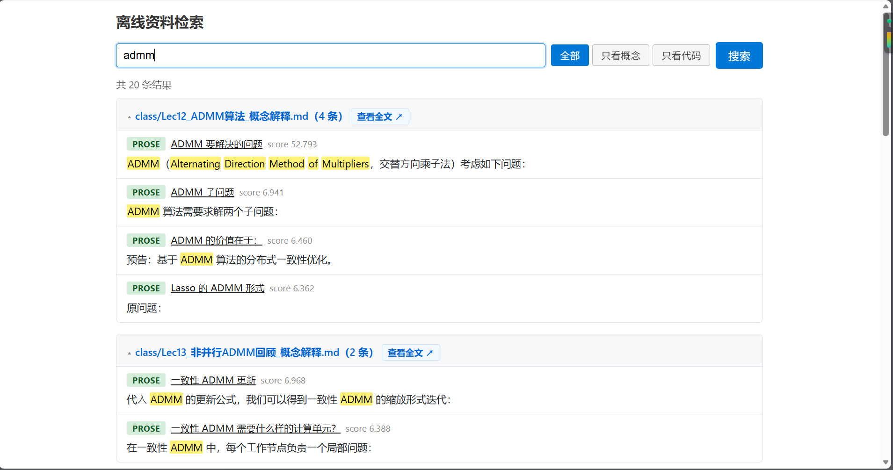

# offline-exam-search

一个**离线、本地**的资料检索工具：把一个文件夹里的 `.md` / `.ipynb` 笔记和代码做高精度索引，能区分"概念定义"与"代码实现"，支持中文短词（两字概念如"范数""凸性"），结果在浏览器里带章节路径、相关度评分和关键词高亮，点击可直接跳转到原文对应位置。

为上机考试这种"不可控、无网络、临场不可修"的环境设计——**全程不依赖任何第三方 pip 包**，clone 下来插上 U 盘就能跑。



---

## 特点与优点

- **零运行依赖**：检索引擎、Web 服务器全部基于 Python 标准库实现，没有 `pip install` 这一步，不存在"考场电脑装不上包"的风险。
- **不依赖编译期特性**：不用 SQLite FTS5（很多机器上的 sqlite3 没编译进这个扩展），纯 Python 倒排索引 + BM25，行为在任何标准 CPython 上一致。
- **中文友好**：字符级 bigram 分词，两字中文概念（"范数""凸性"）也能精确召回，中英文混写、大小写不影响搜索。
- **代码 / 概念分得清**：Markdown 解析时先判断代码围栏状态再判断标题，不会把代码里的 `# 注释` 误识别成标题；搜索结果按"概念讲解（prose）"和"代码实现（code）"分类，可一键筛选。
- **意图识别（软提示）**：搜"XXX 定义"会自动偏向概念讲解，搜"XXX 实现"会自动偏向代码——但只是排序加分和筛选建议，绝不会把结果直接砍掉，你随时可以手动切换筛选项覆盖它。
- **别名 / 同义词展开**：一份 `aliases.txt` 配置，搜简称（如 `ADMM`）和搜全称（"交替方向乘子法"）能找到同一批结果，而不会被全称里某个常见字误召一堆无关内容。
- **精确高亮与跳转**：哪怕不是逐字完全匹配（顺序不同、命中部分别名词），命中的字词依然会标黄；点进结果会精确滚动到文章里对应的标题小节，而不是只打开文件首页。
- **单页体验**：搜索结果、查看全文、返回搜索全部在同一个标签页内完成；刷新页面、浏览器前进/后退都不会丢失之前的搜索状态。
- **看得清**：本地打包了 `marked.js`（Markdown 渲染）、`highlight.js`（代码高亮）、`KaTeX`（数学公式渲染），都在 `web/` 目录里，运行时不连 CDN。

---

## 目录结构

```
.
├── tokenizer.py       # 分词器（中文 bigram + 英文单词），索引和查询共用同一份
├── parser.py          # Markdown / ipynb 解析（围栏状态机、标题栈、heading_path）
├── ranking.py         # BM25 打分、意图识别、别名展开、search() 主逻辑
├── build_index.py     # 构建期：资料目录 → 索引文件 index.pkl
├── search.py          # 命令行检索入口
├── server.py          # 本地 Web 服务器（标准库 http.server）
├── aliases.txt         # 别名/同义词配置（每行一组，用 = 分隔）
├── web/                # 前端（index.html 搜索页 + viewer.html 全文查看页 + 打包的前端库）
├── tests/               # pytest 测试
├── docs/                # 截图、设计/方案文档（docs/design/，纯说明性内容，不影响运行）
└── scripts/             # 维护用脚本（如 download_assets.ps1，可选）
```

> `index.pkl`（索引缓存）和 `materials/`（你的原始笔记）默认被 `.gitignore` 排除，不会上传到仓库——这两个东西因人而异，换一份资料就要重新生成，没必要进版本库。

---

## 快速开始

环境要求：**Python 3.8+ 标准库**，无需安装任何第三方包。

### 1. 构建索引

```bash
python build_index.py <你的笔记目录> -o index.pkl
```

- `<你的笔记目录>`：包含 `.md` / `.ipynb` 文件的文件夹，会递归扫描子目录
- `-o index.pkl`：索引输出路径，默认就是 `index.pkl`

构建完成会打印文件数、块数、token 种类等统计信息。

### 2. 命令行检索（不开 Web 也能用）

```bash
python search.py "ADMM 定义"
python search.py "范数" --type prose      # 只看概念讲解
python search.py "近端梯度法 实现" --type code --topk 5
```

参数：

| 参数 | 说明 |
|---|---|
| `query`（位置参数） | 查询词，支持中英文混写，特殊字符不会报错 |
| `--type {all,prose,code}` | 结果类型筛选，默认 `all` |
| `--topk N` | 最多返回条数，默认 10 |
| `--index <path>` | 索引文件路径，默认 `index.pkl` |

### 3. 启动本地 Web 界面（推荐）

```bash
python server.py --index index.pkl --materials <你的笔记目录> --port 8000
```

然后浏览器打开 **http://127.0.0.1:8000/**。

参数：

| 参数 | 说明 |
|---|---|
| `--index <path>` | 索引文件路径，默认 `index.pkl` |
| `--aliases <path>` | 别名配置路径，默认 `aliases.txt` |
| `--materials <dir>` | **原始笔记目录**，必须和 `build_index.py` 用的目录一致，否则"查看全文"会 404 |
| `--port N` | 监听端口，默认 8000 |

`--materials` 不填的话，搜索结果仍然能看，但点不开"查看全文"。

---

## Web 界面怎么用

1. 顶部输入框输入查询词，回车或点"搜索"。
2. 结果上方有 **全部 / 概念 / 代码** 三个筛选按钮——系统会根据查询词自动猜一个（比如带"定义"自动偏向概念），你点哪个就以哪个为准，之后不会再被自动判断覆盖。
3. 每条结果显示：类型徽章、章节路径（标题层级，如 `Lec 3 > 二、核心 API > API 1`）、相关度分数，命中的关键词（包括别名同义词）会标黄。
4. 点章节路径或"查看全文"会在**同一个标签页**跳转到原文，自动滚动到对应小节并高亮关键词。
5. 在原文页点"返回搜索"，会带着你之前的查询词、筛选项、滚动状态一起跳回去，不会丢结果。
6. 刷新页面、浏览器前进/后退都会保留搜索状态（写在地址栏 URL 里）。

---

## 自定义别名（同义词）

编辑 `aliases.txt`，每行一组同义写法，用 `=` 分隔，`#` 开头是注释：

```
ADMM=交替方向乘子法=alternating direction method of multipliers
范数=norm
凸性=convexity
```

规则：**组内是"且"关系**（一个全称短语的所有字词都要在同一块里出现才算命中），**组间是"或"关系**（命中任意一组的任意写法都算）。这样搜全称不会被其中某个常见字误召一堆无关结果。

---

## 跑测试

```bash
python -m pytest tests/ -q
```

测试覆盖：分词器（中英文混合、bigram）、Markdown/ipynb 解析（围栏状态机、标题栈、新旧格式兼容）、检索排序（BM25、意图识别、别名展开、特殊字符不报错等刁钻场景）。

---

## 离线部署（U 盘场景）

1. `git clone` 这个仓库到任意机器
2. 准备好你的笔记目录，运行一次 `build_index.py` 生成 `index.pkl`
3. 把整个项目文件夹（含生成好的 `index.pkl`）复制进 U 盘
4. 到考试机上插 U 盘，直接 `python server.py --materials <笔记目录> --port 8000`，无需联网、无需安装任何依赖

`web/` 目录下的前端库（`marked.js`、`highlight.js`、`KaTeX`）已经打包进仓库，不会在运行时请求 CDN。如果想更新这些前端库版本，在**有网**的机器上运行 `scripts/download_assets.ps1` 重新下载即可。
